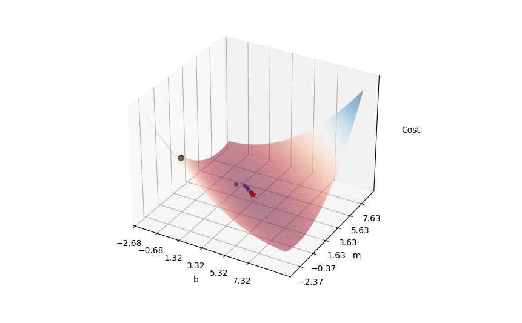
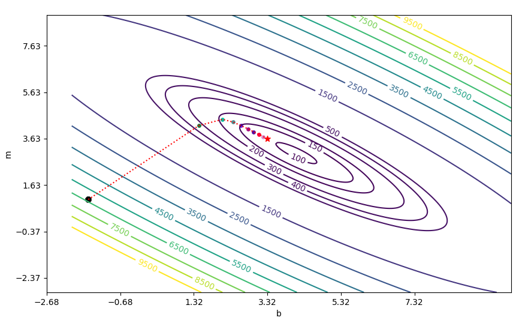

# Stochastic Gradient Descent Demo

Disclaimer: At least 85% of the code is from somewhere on the Internet. Code ideas that are borrowed from other sources will have a comment stating where it is from.

## What is this?

This is a Python code used to demo how SGD would look like on a linear regression problem. It also includes an example code (taken from PyTorch tutorial) to demonstrate the use of SGD in other ML problems like classification.

## I mean what's Stochastic Gradient Descent?

Gradient Descent: https://builtin.com/data-science/gradient-descent

Stochastic Gradient Descent: https://en.wikipedia.org/wiki/Stochastic_gradient_descent. The variant used in this demo is mini-batch SGD with simple momentum.

## Dependencies

[`uv`](https://docs.astral.sh/uv/) is used to install dependencies.

- `numpy`
- `matplotlib`
    - On some systems (like Linux Mint), you may have to install additional system libraries for this to work. I personally had to install `pyqt6` along with other packages.
- `pytorch` (optional, check `uv` docs if you do want it)
    - If you don't run `sgd-torch.py`, this is not needed.

## Resources

- https://pytorch.org/tutorials/beginner/basics/optimization_tutorial.html
- https://www.geeksforgeeks.org/ml-stochastic-gradient-descent-sgd/
- https://docs.astral.sh/uv/concepts/projects/
- https://aunnnn.github.io/ml-tutorial/html/blog_content/linear_regression/linear_regression_tutorial.html
- https://www.stat.cmu.edu/~cshalizi/mreg/15/lectures/13/lecture-13.pdf
- https://numpy.org/doc/2.2/reference/index.html#reference
- https://matplotlib.org/stable/api/_as_gen/matplotlib.axes.Axes.html

## I can't run the code right now, what does it look like?





To replicate this, here's the data config:

```
rng = np.random.default_rng(seed=471)
LEARNING_RATE = 0.0001
EPOCHS = 1000
BATCH_SIZE = 10
MOMENTUM = 0.9
CENTER_ON = (4, 3)
CONTOUR_MIN = 20
CONTOUR_MAX = 400
CONTOUR_STEP = 25
EPOCH_PER_POINT = 100
```

## Setup

If you have `uv` installed, after cloning, simply run `uv sync`, then `uv run main.py`. If you don't want to bother with `uv` and only want to deal with `pip`, follow the below instructions.

Install dependencies from `requirements.txt` (note: I don't actively maintain this file):

```sh
python -m pip install -r requirements.txt
```

Run `main.py`:

```sh
python main.py
```

Replace `python` with the actual Python binary installed on your system (typically `py -3` on Windows, `python3` on Linux, etc.)
